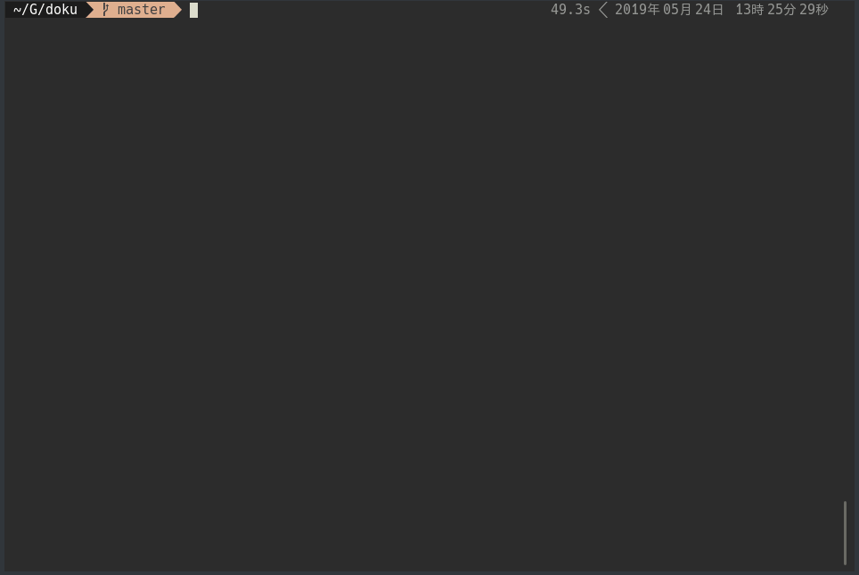

# doku

[](https://goreportcard.com/report/github.com/jon20/doku)
[](https://circleci.com/gh/jon20/doku)

TUI Client Tool for Docker.


## Installation

Working and tested on Linux
### Source

``` go get -u https://github.com/jon20/doku```

## Usage

|panel  |operation  |key  |
|---|---|---|
|all  |change panel  |Tab  |
|all  |quit  |Ctrl + q  |
|Container List  |Container start  | r|
|Container List  |Container stop  | s|
